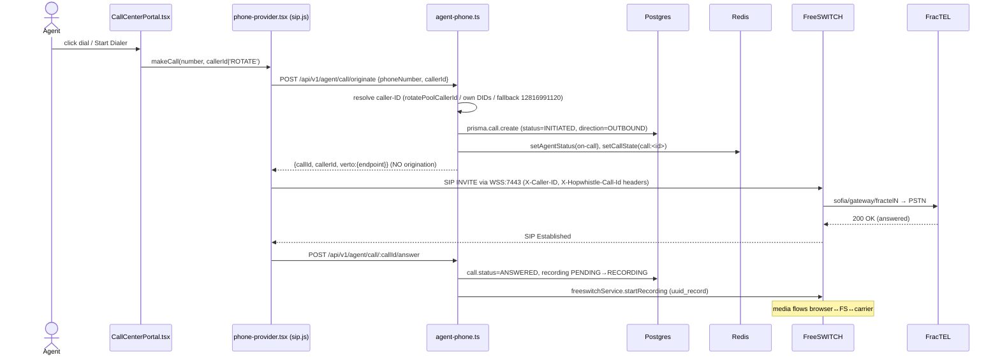
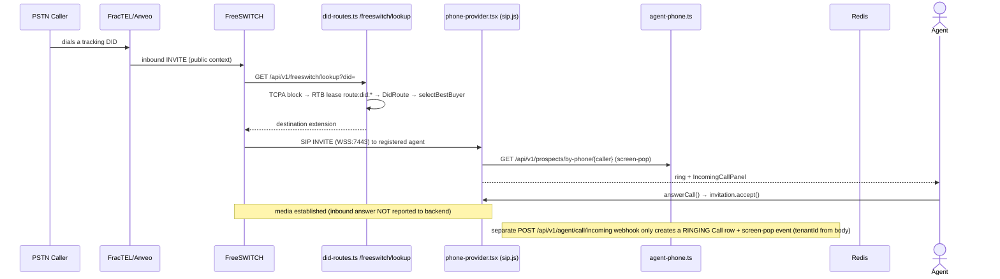

# CURRENT RUNTIME MAP

> Prompt 0 — Read-only runtime audit. Grounded in current code at commit `130416d`. No production behavior was modified. Every flow cites exact repository file paths and functions.

This document traces how the live Hopwhistle telephony platform actually runs **today**, independent of stale documentation. It contains the eight required sequence diagrams plus the routing/carrier reality.

**Companion docs:** `CURRENT_WORKER_STARTUP_MAP.md` (dialers), `EXISTING_ROUTE_CONTRACTS.md` (endpoints), `PROTECTED_SYSTEM_INVARIANTS.md` (what must not change), `MULTITENANT_GAP_ANALYSIS.md` (tenancy gaps), `ENVIRONMENT_VARIABLE_MAP.md` (env), `VOICE_AI_INTEGRATION_AUDIT.md` (aivoice.hopwhistle.com correction).

---

## 0. The three independent origination paths

There is **no single "originate" function**. Three unrelated code paths reach FreeSWITCH (FS), and a fourth (legacy) is dead:

| Path                                 | Entry point                                             | How it originates                                                                                         | Gateway                                | Caller-ID source                                               |
| ------------------------------------ | ------------------------------------------------------- | --------------------------------------------------------------------------------------------------------- | -------------------------------------- | -------------------------------------------------------------- |
| **Human dialer** (agent softphone)   | `apps/api/src/routes/agent-phone.ts`                    | Browser places SIP INVITE via **sip.js over FS WebSocket** (WSS :7443 / WS :8083). API only tracks state. | FracTEL (`default` dialplan)           | DB `PhoneNumber` inventory + hard-coded fallback `12816991120` |
| **Background dialer** ("The Hopper") | `apps/worker/src/services/dialer-worker.ts`             | `modesl` ESL `bgapi originate`                                                                            | FracTEL `fractel1-6` round-robin       | DB `PhoneNumber` pool + fallback `+18656000124`                |
| **Voice-AI**                         | `aivoice.hopwhistle.com` (self-hosted Dograh, external) | Dograh's own telephony (out of this repo)                                                                 | Dograh-managed                         | Dograh-managed                                                 |
| **Legacy Vapi campaigns** (dormant)  | `apps/api/src/routes/ai-campaigns.ts`                   | _No dialer exists_ — reaches `RUNNING` but never places calls                                             | (would be Vapi cloud)                  | n/a                                                            |
| **Legacy Autodialer** (dead)         | `apps/worker/src/services/autodialer.ts`                | raw TCP ESL                                                                                               | `didcentral` (no gateway XML — broken) | hard-coded `DID_POOL`                                          |

> ⚠️ **"Verto" is a misnomer.** The browser client is **sip.js** (`UserAgent`/`Inviter`/`Registerer`, [`apps/web/src/components/phone/phone-provider.tsx:12-20`](../../apps/web/src/components/phone/phone-provider.tsx)), not Verto. The `verto:` field returned by the API and the `VERTO_WS_URL`/`:8082` credential are computed but discarded by the client (which hard-codes `:7443`/`:8083`).

> ⚠️ **Voice-AI correction:** The canonical Voice AI application is the **self-hosted Dograh app at `https://aivoice.hopwhistle.com`** (server path `/opt/dograh`), embedded into `/voice-agents` via an SSO cookie + iframe (HEAD commit `130416d`). The in-repo Vapi `ai-campaigns` / `music-console-voice` code is **legacy and orphaned from navigation**. See `VOICE_AI_INTEGRATION_AUDIT.md` for the full trace and the required final statement.

---

## 1. Human OUTBOUND call

- UI: [`CallCenterPortal.tsx`](../../apps/web/src/components/call-center/CallCenterPortal.tsx) `DialPad` (line 1737) or `startCallWithApplication` (line 1055) → `usePhone().makeCall(...)`.
- Client: [`phone-provider.tsx`](../../apps/web/src/components/phone/phone-provider.tsx) `makeCall` (820–955).
- API: [`agent-phone.ts`](../../apps/api/src/routes/agent-phone.ts) `POST /api/v1/agent/call/originate` (263–465) — **state only, no origination** (comment at 446–448: "The actual call is placed via Verto WebRTC from the browser").
- Recording is started server-side on answer via `freeswitchService.startRecording` (agent-phone.ts:535).



---

## 2. Human INBOUND call

Two independent inbound paths that are **not wired to each other**:

- **(a) Real media** — FS routes a DID to the registered extension; sip.js `onInvite` (`phone-provider.tsx:1387`) → `handleIncomingSipCall` (550–636); screen-pop via `GET /api/v1/prospects/by-phone/{num}`. DID→extension mapping maintained by `didRouteService.syncDidRouteForNumber`.
- **(b) Screen-pop webhook (no media)** — `POST /api/v1/agent/call/incoming` (`agent-phone.ts:1126-1248`); **`tenantId` comes from the request body** (`body.tenantId ?? 'demo-tenant'`, line 1130) — unauthenticated, self-asserted.



---

## 3. Human call RECORDING

Two mechanisms; the ESL path (human answer) uses `uuid_record`, the dialplan path uses `record_session` with stereo/16k. Files land at `/recordings/<callId>.wav`, uploaded on hangup by `apps/freeswitch/scripts/upload-recording.sh`.

- ESL: `freeswitch-service.ts` `startRecording` (149–216) → `uuid_record <uuid> start /recordings/<callId>.wav`; sets `api_hangup_hook = bg_system upload-recording.sh`.
- Dialplan (`default` context): [`apps/freeswitch/conf/dialplan/default.xml:127-134`](../../apps/freeswitch/conf/dialplan/default.xml) → `RECORD_STEREO=true`, `RECORD_SAMPLE_RATE=16000`, `record_session`.
- Ingestion: `POST /api/v1/recordings/upload` → `RecordingService.uploadRecording` ([`recording-service.ts:29`](../../apps/api/src/services/recording-service.ts)) → S3/MinIO → upsert `Recording` row → `Call.recordingStatus='READY'` → publish `recording.ready`.

```mermaid
sequenceDiagram
    participant FS as FreeSWITCH
    participant Script as upload-recording.sh
    participant API as recordings.ts
    participant RS as RecordingService
    participant S3 as MinIO/S3
    participant DB as Postgres
    participant Bus as eventBus (events:stream)

    Note over FS: on answer, uuid_record OR record_session (stereo 16k) → /recordings/<callId>.wav
    FS->>FS: call hangup → api_hangup_hook
    Script->>Script: wait ≤10s for WAV to stabilize (reject ≤100 bytes)
    Script->>API: POST /api/v1/recordings/upload (multipart file, callId) [x-api-key optional]
    API->>RS: uploadRecording(callId, file)
    RS->>S3: PUT recordings/YYYY/MM/DD/<callId>.wav
    RS->>DB: upsert Recording; Call.recordingStatus=READY, recordingUrl=/api/v1/recordings/<id>/stream
    RS->>Bus: publish recording.ready {tenantId, signedUrl(1h)}
    Note over API,DB: on failure → markRecordingFailed → recording.failed; reconciler repairs stuck rows on demand
```

Playback: `GET /api/v1/recordings/:id/stream` is **tenant + role scoped** (`where:{ id, call:{ tenantId } }` + `checkRecordingAccess`). ⚠️ Exception: `GET /api/v1/recordings/local-stream/*` has **no auth/tenant check** (see gap analysis).

---

## 4. Existing browser AUTO-DIAL progression

Fully **browser-driven** inside `CallCenterPortal.tsx` (no server pacing). State at lines 152–163 (`isAutoDialing`, `autoDialIndex`, `autoDialStatus`, `wrapUpCountdown`, `dialedLeadIdsRef`).

```mermaid
sequenceDiagram
    actor Agent
    participant Portal as CallCenterPortal.tsx
    participant Phone as phone-provider.tsx
    participant API as agent-phone.ts

    Agent->>Portal: click "Start Dialer" (line 2001)
    Portal->>Portal: getNextDialIndex() (1125) → pick lead
    loop until queue exhausted
        Portal->>Portal: startCallWithApplication(lead) (1055) → add to dialedLeadIdsRef
        Portal->>Phone: makeCall(cleanPhone, 'ROTATE') (1081)
        Phone->>API: POST /api/v1/agent/call/originate (see §1)
        Note over Portal: call ends → handleSaveDisposition (741) or auto-dispo (373-397: <5s=DISCONNECTED else NO_ANSWER)
        Portal->>Portal: autoDialStatus='wrapup', wrapUpCountdown=5 (1030)
        Portal->>Portal: wrap-up timer decrements (1187-1227); at 0 → startCallWithApplication(next)
    end
    Portal-->>Agent: alert("queue complete")
```

Known limitation flagged in code (lines 161–163): the `applications` list is not refreshed mid-run, so a session `Set` (`dialedLeadIdsRef`) is used to avoid re-dialing.

---

## 5. Existing background-worker dial (The Hopper)

Full detail in `CURRENT_WORKER_STARTUP_MAP.md` §3. Sequence:

```mermaid
sequenceDiagram
    participant Loop as DialerWorker.runDialerLoop (every 1s)
    participant DB as Postgres
    participant Redis
    participant FS as FreeSWITCH (ESL 8021)
    participant Carrier as FracTEL
    participant Bot as Fronter Bot (TCP socket)

    Loop->>Redis: getActiveCallCount (dialer:active_calls / show calls count)
    Loop->>Loop: availableSlots = MAX_CONCURRENT_CALLS - active
    Loop->>DB: fetchLeadsToDial — leads.status='NEW' AND campaigns.status='ACTIVE' (raw SQL)
    Loop->>DB: mark lead DIALING
    Loop->>DB: getNextCallerId(tenantId) — PhoneNumber provider=fractel poolType=POOL (60s cache)
    Loop->>FS: bgapi originate {caller-id + hopwhistle_* vars}sofia/gateway/fractelN/+E164 &socket(host:port async full)
    FS->>Carrier: PSTN dial
    Carrier-->>FS: answered
    FS->>Bot: outbound socket connect (async full)
    Bot->>Bot: answer → play intro → waitForDTMF
    alt press 1
        Bot->>DB: lead=TRANSFERRED
        Bot->>FS: transfer queue-default XML default
    else press 9 / timeout
        Bot->>DB: lead=NOT_INTERESTED / NO_RESPONSE → hangup
    end
    Note over Loop,DB: NO quota/budget check; only MAX_CONCURRENT_CALLS throttles. Billing computed later by BillingWorker from events:stream.
```

---

## 6. Voice-AI OUTBOUND call

**Canonical path (current):** the Dograh app at `aivoice.hopwhistle.com` originates via its **own** telephony stack, outside this repo. The main app's only role is SSO (mint cookie) + iframe embed. See `VOICE_AI_INTEGRATION_AUDIT.md`.

**Legacy in-repo Vapi paths (for completeness — not the canonical Voice AI):**

- `ai-campaigns` — **has no dialer**; `startCampaign` (`ai-campaign-service.ts:593`) only flips status to `RUNNING`. No code inserts `ai_campaign_calls` or calls Vapi `/call`. The webhook keys off `call.metadata.callRecordId`, which nothing sets → dead pipeline.
- `music-console-voice` — the one legacy path that actually dials, **driven from the browser** (`music-console/voice/page.tsx` `dispatchCampaign`).

```mermaid
sequenceDiagram
    actor User
    participant Sidebar as sidebar.tsx "AI Voice"
    participant Page as voice-agents/page.tsx
    participant API as aivoice.ts (SSO)
    participant Dograh as aivoice.hopwhistle.com (external)
    participant Tel as Dograh telephony

    User->>Sidebar: click "AI Voice"
    Sidebar->>Page: navigate /voice-agents
    Page->>API: GET /api/v1/aivoice/session (auth-gated)
    API->>API: signDograhToken (HS256, AIVOICE_JWT_SECRET) → set dograh_auth_token/user cookies (.hopwhistle.com)
    API-->>Page: {url: AIVOICE_URL}
    Page->>Dograh: <iframe src=AIVOICE_URL allow="microphone; autoplay; clipboard-write">
    Dograh->>Dograh: middleware reads dograh cookies → authenticated (skips /auth/login)
    Note over Dograh,Tel: agent builds/runs voice agents; outbound AI calls placed by Dograh's own provider (out of repo)
```

_(Legacy music-console dispatch, if ever re-surfaced: `page.tsx dispatchCampaign` → `POST /api/v1/music-console/voice-agents/:id/calls` → resolve DID→Vapi phoneNumberId → `POST api.vapi.ai/call/phone` → Vapi BYO credential → FS:5070 `vapi_outbound` → FracTEL → PSTN.)_

---

## 7. Vapi WEBHOOK completion (legacy)

`POST /api/v1/webhooks/vapi` ([`ai-campaigns.ts` `registerVapiWebhookRoutes`](../../apps/api/src/routes/ai-campaigns.ts), no auth, no signature verification) → `handleVapiWebhook` ([`ai-campaign-service.ts:674`](../../apps/api/src/services/ai-campaign-service.ts)). **Currently inert** because no code sets the `call.metadata.callRecordId` it requires.

```mermaid
sequenceDiagram
    participant Vapi as Vapi cloud
    participant WH as POST /api/v1/webhooks/vapi (no auth)
    participant Svc as handleVapiWebhook
    participant DB as Postgres

    Vapi->>WH: message {type, call, metadata}
    WH->>Svc: handleVapiWebhook(payload)
    Svc->>Svc: require call.metadata.callRecordId  ❌ never set → short-circuit
    alt call-started
        Svc->>DB: UPDATE ai_campaign_calls status=IN_PROGRESS
    else call-ended
        Svc->>Svc: map endedReason→AICallStatus; cost = call.cost | minutes*costPerMinute; billable=cost*1.2
        Svc->>DB: UPDATE ai_campaign_calls + ai_campaign_contacts
        Svc->>DB: deductFromWallet → tenantBudget; auto-pause RUNNING campaigns if <$5
    end
    WH-->>Vapi: 200 {received:true}  (errors swallowed → 200)
```

---

## 8. DID selection & carrier routing

**Active gateway = FracTEL** (`fractel1-6`) across every live path. `didcentral` is a dead reference (no gateway XML); BulkVS is retired-but-referenced; SignalWire/Anveo/Telnyx/Voxbeam/Wholesale are dormant. STIR/SHAKEN signing is **delegated to FracTEL** (no local PASSporT signing; `stir-shaken-service.ts` is bookkeeping only). Gateway defs: `apps/freeswitch/conf/sip_profiles/external/*.xml`.

**Outbound caller-ID (Hopper) decision sequence:**

```mermaid
sequenceDiagram
    participant Loop as DialerWorker
    participant DB as PhoneNumber table
    participant Rot as getNextCallerId
    participant GW as getNextGateway
    participant FS as FreeSWITCH

    Loop->>Rot: getNextCallerId(tenantId)
    Rot->>DB: PhoneNumber where provider=fractel status=ACTIVE poolType=POOL (60s cache)
    alt pool non-empty
        Rot-->>Loop: rotate by index → DID
    else pool empty
        Rot-->>Loop: fallback +18656000124 (OUTBOUND_CALLER_ID)
    end
    Loop->>GW: getNextGateway() → fractel1..6 round-robin
    Loop->>FS: originate ...origination_caller_id_number=<DID>...sofia/gateway/fractelN/+E164
    Note over FS: FracTEL signs A-attestation if caller-ID is a FracTEL DID, else B
```

**Human dialer caller-ID:** `agent-phone.ts:279` — `outboundCallerId = callerId || OUTBOUND_CALLER_ID || '12816991120'`. `'ROTATE'` → `rotatePoolCallerId` (LRU over DB pool, 284–300); else agent's own assigned DIDs (excludes numbers containing `555`, 309–332). All DB-driven with the single hard-coded literal fallback.

**Inbound routing** (`did-routes.ts /freeswitch/lookup`): TCPA litigator block → Redis RTB lease `route:did:*` → DB `DidRoute` → if `campaignId`, `routingService.selectBestBuyer` (geo by area-code, concurrency, agent-status) → destination.

---

## 9. Deployment reality (production vs docs)

- **Production is `infra/docker/docker-compose.dev.yml` on Hetzner `178.156.223.97` (`/opt/hopwhistle`), deployed by `deploy.ps1`** (branch `edit-campaign-buyer-fix`, container names `hopwhistle-*-dev`, `NODE_ENV=development`). Full self-contained stack: postgres:16, redis:7, minio, clickhouse, api, web, worker, freeswitch, kamailio, rtpengine, prometheus, grafana.
- `docker-compose.prod.yml` is an **app-only overlay** (api/web/worker) attaching to the dev datastore containers via external `docker_hopwhistle-network`.
- `docker-compose.voice.yml` is a FreeSWITCH/kamailio/rtpengine **voice edge overlay** on a _different_ DigitalOcean host (`107-170-36-116.sslip.io`) — **not** the Dograh/AI-Voice app.
- `app.yaml` (DO App Platform) and `DEPLOYMENT.md`/`DROPLET_DEPLOY.md` describe **retired** DigitalOcean targets — see `PROTECTED_SYSTEM_INVARIANTS.md` §Stale-docs.
- FreeSWITCH publishes 5070/udp+tcp (Vapi SIP profile), 8021 (ESL), 8082/8083 (Verto WS), 7443 (WSS/WebRTC), 5080 (external SIP), 16384-16484/udp (RTP). Kamailio is the 5060 SIP edge; rtpengine on 22222 + 10000-10100/udp.

---

## 10. Stale-assumption callouts (documentation vs code)

| Assumption in docs                           | Reality                                                                                                |
| -------------------------------------------- | ------------------------------------------------------------------------------------------------------ |
| Autodialer is the active dialer              | Disabled; The Hopper (`dialer-worker.ts`) is the only active dialer                                    |
| `didcentral` gateway routes calls            | Dead reference — no gateway XML exists                                                                 |
| Browser calling uses "Verto"                 | It's **sip.js**; the `verto` fields are vestigial                                                      |
| Vapi is the live Voice AI                    | Canonical Voice AI is self-hosted **Dograh** at `aivoice.hopwhistle.com`; Vapi code is legacy/orphaned |
| Deploy = DigitalOcean App Platform / Droplet | Deploy = Docker Compose (`dev.yml`) on **Hetzner**                                                     |
| STIR/SHAKEN signed locally                   | Signing delegated to FracTEL carrier                                                                   |
| AI campaigns place calls                     | `ai-campaigns` has no dialer; only browser-driven `music-console` dispatch ever dialed                 |
